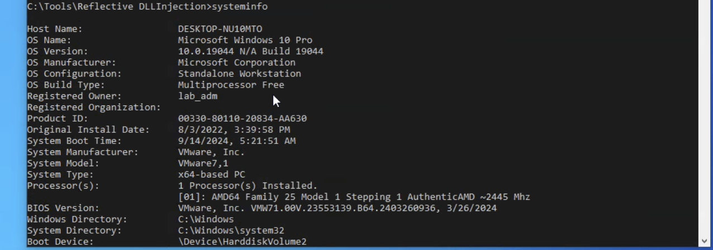
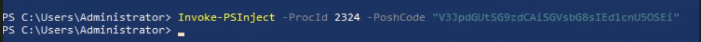
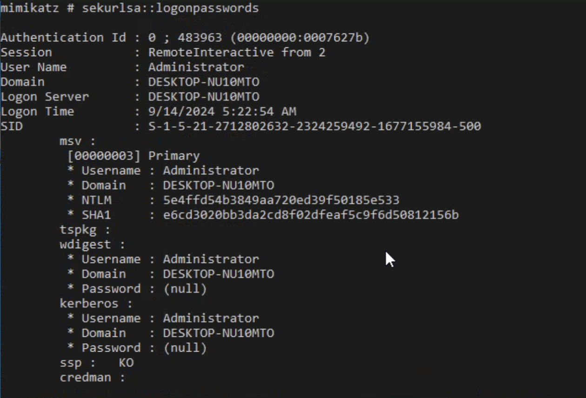
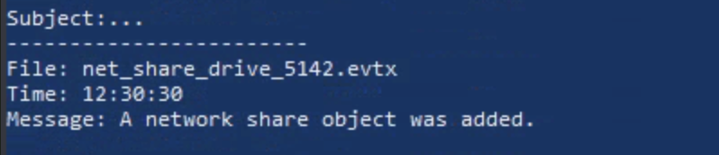

# 🛡️ HTB SOC Analyst Path — Windows Event Logs & Sysmon Writeup

> **Module:** Windows Event Logs & Sysmon Analysis  
> **Path:** SOC Analyst  
> **Difficulty:** Medium  
> **Date:** September 28, 2024  
> **Tags:** `windows` `sysmon` `powershell` `credential-dumping` `dll-hijacking` `ETW` `threat-detection`

> ⚠️ **Note:** This writeup is intended as an educational companion to the HTB SOC Analyst Path. Specific answers have been omitted — work through the challenges yourself to get the most out of this certification.

---

## 📖 Overview

This module covers hands-on detection and replication of common Windows-based attacks using Sysmon and Event Logs. The key attacks explored are:

- **DLL Hijacking** — abusing DLL search order to execute malicious code
- **Unmanaged PowerShell Injection** — injecting .NET runtime into a non-PowerShell process
- **Credential Dumping** — extracting NTLM hashes via Mimikatz
- **ETW Monitoring** — using SilkETW to intercept .NET runtime events
- **Log Analysis** — using `Get-WinEvent` and Chainsaw to hunt through event logs

---

## 🔬 Challenge 1: DLL Hijacking with Reflective DLL Injection

### 🧠 Concept

DLL hijacking exploits the Windows DLL search order. When an application loads a DLL by name without a full path, Windows searches through a list of directories in a specific order. If an attacker places a malicious DLL with the correct name in a directory that appears earlier in the search order (e.g., the application's own folder), Windows will load the malicious DLL instead of the legitimate one.

### 🚶 Walkthrough

**Step 1 — RDP into the target machine**

```bash
xfreerdp /u:Administrator /p:'HTB_@cad3my_lab_W1n10_r00t!@0' /v:<TARGET-IP> /dynamic-resolution
```

**Step 2 — Check the system architecture**

Open CMD and run:

```cmd
systeminfo
```

Look for the `System Type` field. This determines which DLL from `C:\Tools\Reflective DLLInjection` you should use — make sure the architecture matches your target system.

> 

**Step 3 — Rename the malicious DLL**

Rename the appropriate DLL to match the name of a DLL loaded by your target application. Think about which DLL the target application depends on and would search for at runtime.

```cmd
cd "C:\Tools\Reflective DLLInjection"
ren "<source_dll>" <target_dll_name>
```

**Step 4 — Stage the attack**

Copy both the target application and your renamed DLL into the same directory. When the application launches, it will find your DLL first due to search order precedence.

```cmd
copy C:\Windows\System32\<target_app> C:\Users\Administrator\Desktop\<target_app>
copy <malicious.dll> C:\Users\Administrator\Desktop\<malicious.dll>
```

**Step 5 — Execute the application**

Run the application from the Desktop. A successful hijack will produce a visible indicator confirming your DLL was loaded instead of the legitimate one.

> 📸 *[Screenshot: Confirmation popup from DLL execution]*

**Step 6 — Retrieve the SHA256 hash of your malicious DLL**

*PowerShell:*
```powershell
Get-FileHash <path_to_dll> -Algorithm SHA256
```

*CMD:*
```cmd
CertUtil -hashfile <path_to_dll> SHA256
```

> 

> 💡 **Detection tip:** Defenders can catch this via **Sysmon Event ID 7 (Image Load)** — look for DLLs loaded from unusual directories like a user's Desktop instead of `System32`.

---

## 🔬 Challenge 2: Unmanaged PowerShell Injection

### 🧠 Concept

"Unmanaged PowerShell" injects the .NET CLR (Common Language Runtime) directly into a process that wouldn't normally run PowerShell — bypassing detections that rely on seeing `powershell.exe` in the process tree. A key observable side effect is that .NET runtime DLLs (like `clrjit.dll`) get loaded into the target process, which can be detected by defenders.

### 🚶 Walkthrough

**Step 1 — Launch PowerShell with execution policy bypassed**

```powershell
powershell -ep bypass
```

**Step 2 — Import the PSInject module**

```powershell
Import-Module C:\Tools\PSInject\Invoke-PSInject.ps1
```

**Step 3 — Identify your target process**

```powershell
Get-Process <process_name>
```

Note down the `Id` (PID) value.

> 

**Step 4 — Inject PowerShell code into the target process**

```powershell
Invoke-PSInject -ProcId <PID> -PoshCode "V3JpdGUtSG9zdCAiSGVsbG8sIEd1cnU5OSEi"
```

**Step 5 — Verify injection using Process Hacker**

Open **Process Hacker**, locate your target process → right-click → **Properties** → **Modules** tab. Look for newly loaded .NET runtime DLLs and note their full paths.

> 📸 *[Screenshot: Process Hacker Modules tab showing injected DLLs]*

**Step 6 — Hash the loaded DLL**

```powershell
Get-FileHash "<path_to_dll>" -Algorithm SHA256
```

> 

> 💡 **Detection tip:** Monitor for .NET runtime DLLs loading into non-.NET processes — this is a strong indicator of unmanaged PowerShell injection.

---

## 🔬 Challenge 3: Credential Dumping with Mimikatz

### 🧠 Concept

Mimikatz interfaces directly with LSASS (Local Security Authority Subsystem Service) — the Windows process responsible for managing authentication — to extract plaintext passwords, NTLM hashes, and Kerberos tickets from memory. This is one of the most common post-exploitation techniques used by real-world attackers.

### 🚶 Walkthrough

**Step 1 — Open an elevated CMD and navigate to Mimikatz**

```cmd
cd C:\Tools\Mimikatz
mimikatz.exe
```

**Step 2 — Enable debug privileges**

```
privilege::debug
```

Look for confirmation that the privilege was granted successfully before proceeding.

**Step 3 — Dump credentials from LSASS**

```
sekurlsa::logonpasswords
```

Scroll through the output and locate the target account. The NTLM hash will be clearly labeled.

> 

> 💡 **Detection tip:** This is visible via **Sysmon Event ID 10 (Process Access)** — flag any process opening a handle to `lsass.exe` with suspicious access rights (e.g., `0x1010`).

---

## 🔬 Challenge 4: Tapping into ETW with SilkETW

### 🧠 Concept

ETW (Event Tracing for Windows) is a kernel-level logging framework built into Windows. Tools like **SilkETW** subscribe to provider channels — such as the .NET Runtime provider — and capture rich telemetry in real time. This is a powerful blue-team technique that can catch fileless attacks invisible to traditional log-based detection.

### 🚶 Walkthrough

**Step 1 — Start SilkETW to monitor .NET Runtime events**

```cmd
c:\Tools\SilkETW_SilkService_v8\v8\SilkETW.exe -t user -pn Microsoft-Windows-DotNETRuntime -uk 0x2038 -ot file -p C:\windows\temp\etw.json
```

| Flag | Meaning |
|------|---------|
| `-t user` | User-mode tracing |
| `-pn` | Provider name |
| `-uk 0x2038` | Keyword filter bitmask |
| `-ot file` | Output to file |
| `-p` | Output path |

**Step 2 — While SilkETW is running, execute Seatbelt**

```powershell
cd "C:\Tools\GhostPack Compiled Binaries"
.\Seatbelt.exe TokenPrivileges
```

> 📸 *[Screenshot: Seatbelt running in PowerShell]*

**Step 3 — Inspect the ETW output**

Search the output JSON for `ManagedInteropMethodName` entries relating to token operations:

```powershell
Get-Content C:\windows\temp\etw.json | ConvertFrom-Json | Where-Object { $_.ManagedInteropMethodName -ne $null }
```

The answer follows a specific naming pattern — look carefully at the method names and match the hint given in the question.

> 📸 *[Screenshot: etw.json output with method names visible]*

> 💡 **Detection tip:** ETW reveals API calls made by malicious .NET assemblies that are completely invisible to file-based AV — invaluable for detecting in-memory threats.

---

## 🔬 Challenge 5: Get-WinEvent Log Analysis

### 🧠 Concept

`Get-WinEvent` is a powerful PowerShell cmdlet for querying `.evtx` Windows Event Log files. This challenge simulates offline log triage — hunting for a specific network share creation event across multiple log files without a SIEM.

### 🚶 Walkthrough

**Step 1 — Search across all .evtx files for share-related events**

```powershell
Get-ChildItem "<log_directory>" -Filter *.evtx | ForEach-Object {
    $events = Get-WinEvent -Path $_.FullName -ErrorAction SilentlyContinue |
        Where-Object { $_.Message -like "*share*" }
    if ($events) {
        Write-Output "File: $($_.Name)"
        $events | Select-Object -First 5 | ForEach-Object {
            Write-Output "Time: $($_.TimeCreated.ToString('HH:mm:ss'))"
            Write-Output "Message: $($_.Message.Substring(0, [Math]::Min(100, $_.Message.Length)))..."
            Write-Output "---"
        }
    }
}
```

**What this command does:**
- `Get-ChildItem ... -Filter *.evtx` — finds all event log files in the directory
- `Where-Object { $_.Message -like "*share*" }` — filters for events mentioning a share
- `TimeCreated.ToString('HH:mm:ss')` — formats the timestamp for the answer

Look through the output for an event relating to a `PRINT` share being added. The timestamp of that event is your answer.

> 

---

## 🎯 Skills Assessment

> ⚠️ **Try these yourself before reading further.** The skills assessment is where the real learning happens — each question builds on techniques from the module. Hints only are provided below.

**Q1 — DLL Hijack process (`C:\Logs\DLLHijack`)**  
Hunt for `.exe` names in event messages. Think about which Windows system utilities might legitimately load DLLs from unusual paths.

```powershell
Get-ChildItem "C:\Logs\DLLHijack" -Filter *.evtx | ForEach-Object {
    Get-WinEvent -Path $_.FullName -ErrorAction SilentlyContinue |
        Where-Object { $_.Message -like "*.exe*" } |
        ForEach-Object { $_.Message | Select-String -Pattern '\b\w+\.exe\b' -AllMatches } |
        ForEach-Object { $_.Matches.Value }
} | Sort-Object -Unique
```

**Q2 — Unmanaged PowerShell process (`C:\Logs\PowershellExec`)**  
Windows Event Viewer can be helpful when PowerShell queries don't surface the answer cleanly. Look for a process that wouldn't normally be associated with PowerShell execution.

**Q3 — Process that injected into Q2's process (`C:\Logs\PowershellExec`)**  
Search for `CreateRemoteThread` events — Sysmon Event ID 8 captures cross-process injection.

```powershell
Get-WinEvent -Path "<logfile>.evtx" |
    Where-Object { $_.Message -like "*CreateRemoteThread*" }
```

**Q4 — LSASS dump process (`C:\Logs\Dump`)**  
Look for processes that opened a handle to `lsass.exe`. Consider that many tools beyond Mimikatz can perform LSASS dumps.

**Q5 — Ill-intended login after LSASS dump (`C:\Logs\Dump`)**  
Cross-reference the timeline. Did any logon events (Event ID 4624) follow the dump with suspicious characteristics?

**Q6 — Strange PPID process (`C:\Logs\StrangePPID`)**  
Look for Sysmon Event ID 1 (Process Create) where the parent-child relationship doesn't make sense — e.g., a system error handler being spawned by an unusual parent.

---

## 🧰 Tools Used

| Tool | Purpose |
|------|---------|
| [Sysmon](https://learn.microsoft.com/en-us/sysinternals/downloads/sysmon) | System-level event logging |
| [Mimikatz](https://github.com/gentilkiwi/mimikatz) | Credential extraction |
| [PSInject](https://github.com/EmpireProject/PSInject) | Unmanaged PowerShell injection |
| [SilkETW](https://github.com/mandiant/SilkETW) | ETW-based telemetry collection |
| [Seatbelt](https://github.com/GhostPack/Seatbelt) | Host enumeration & recon |
| [Process Hacker](https://processhacker.sourceforge.io/) | Live process & module inspection |
| [Chainsaw](https://github.com/WithSecureLabs/chainsaw) | Fast EVTX log hunting |
| `Get-WinEvent` | PowerShell cmdlet for log analysis |

---

## 📚 Key Takeaways

- **DLL Hijacking** is detectable via Sysmon Event ID 7 — watch for DLLs loading from unexpected paths
- **Unmanaged PowerShell** bypasses `powershell.exe` detections — monitor for .NET runtime DLLs in non-.NET processes
- **Credential Dumping** leaves traces in Sysmon Event ID 10 — flag suspicious access to `lsass.exe`
- **ETW** catches in-memory attacks invisible to file-based detection
- **`Get-WinEvent`** is essential for offline log triage without a SIEM

---

*Writeup by [Your Name] | [GitHub Profile](https://github.com/yourusername)*
